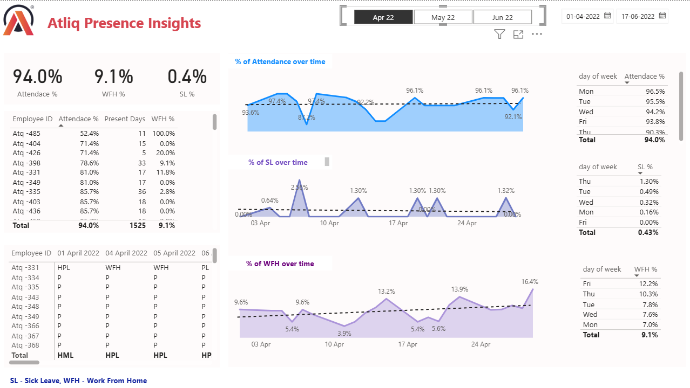

# HR Analytics Dashboard 📊

An interactive dashboard built in Power BI to visualize and analyze HR data like sick leaves, work from home trends, and overall employee attendance.

## 🔧 Tools Used
- Power BI
- Power Query
- DAX

## 📌 Key Features
- Cleaned and transformed HR data
- DAX measures for leave calculations
- Dynamic slicers for filtering by department, gender, etc.
- Visually rich dashboard layout

## 📸 Screenshots

## 🧠 Insights Extracted
- Trends in work from home vs. sick leave
- Department-wise leave analytics
- Overall employee availability patterns

## 🚀 How to Run
1. Clone/download this repository
2. Open `HR Analytics Dashboard.pbix` in Power BI Desktop
3. Refresh data and explore the dashboard

---
